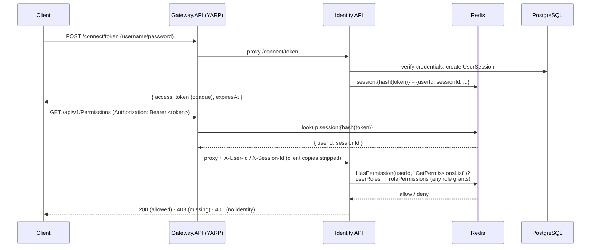

<p align="center">
  
</p>

# GM.Identity Samples

[](https://github.com/gmetskhvarishvili/GM.Identity.Samples/actions/workflows/ci.yml)
[](LICENSE)

A layered **DDD + CQRS** identity & access-management sample built on the **GM.\*** ecosystem: an
identity server behind a **YARP** API gateway, with **opaque bearer tokens**, **Redis-backed sessions
and RBAC**, and per-action **permission** checks. Targets **.NET 10**, **PostgreSQL** and **Redis**.

It assembles real building blocks from
**[GM.Identity](https://www.nuget.org/packages/GM.Identity)** (PBKDF2 hashing, opaque tokens, claims),
**[GM.API](https://www.nuget.org/packages/GM.API)** (Web API startup, versioning, Swagger, idempotency,
health, current-actor, secrets),
**[GM.Gateway](https://www.nuget.org/packages/GM.Gateway)** (YARP edge + rate limiting + actor forwarding),
**[GM.Mediator](https://www.nuget.org/packages/GM.Mediator)** (CQRS dispatch),
**[GM.EntityFramework](https://www.nuget.org/packages/GM.EntityFramework)** (repository / unit of work /
domain-event store / actor auditing),
**[GM.Caching](https://www.nuget.org/packages/GM.Caching)** + **[GM.DistributedLock](https://www.nuget.org/packages/GM.DistributedLock)** (Redis),
**[GM.RateLimiting](https://www.nuget.org/packages/GM.RateLimiting)**, **[GM.Idempotency](https://www.nuget.org/packages/GM.Idempotency)**,
**[GM.HealthChecks](https://www.nuget.org/packages/GM.HealthChecks)**, **[GM.Secrets](https://www.nuget.org/packages/GM.Secrets)**,
**[GM.Scheduling](https://www.nuget.org/packages/GM.Scheduling)** (reconciliation jobs) and
**[GM.Messaging](https://www.nuget.org/packages/GM.Messaging)** (Wolverine outbox).

## Authentication & authorization flow

Tokens are **opaque** (random strings; only their hash is stored). A session is written to Redis at
login, the **gateway** validates the bearer token against that store and forwards the caller's identity
as trusted headers, and the **API** enforces per-action permissions from a Redis RBAC projection — no
database round-trip on the hot path.



- **Opaque tokens & sessions** — `TokenGenerator.Generate()` issues the token; only `TokenGenerator.Hash(token)`
  is persisted (as `UserSession.TokenHash`) and used as the Redis session key. Sessions carry a TTL and are
  removed on revoke; a background job reconciles them from the DB.
- **Gateway validation** — a custom `Bearer` authentication handler looks the token up in Redis and builds
  the principal; `GM.Gateway`'s actor forwarding injects `X-User-Id` / `X-Session-Id` (stripping any
  client-supplied copies, anti-spoof). The API trusts these because it is only reachable through the gateway.
- **RBAC in Redis** — `userId → {roleId}` and `roleId → {permissionId}` are Redis SETs. A user is granted a
  permission when **any** of their roles holds it. Write-through on assignment + a reconciliation job keep it
  in sync with PostgreSQL (the source of truth).
- **`[HasPermission(nameof(Action))]`** gates each management action; the permission name equals the action
  name and is resolved to its id via Redis. Owner-scoped `/me`, `/me/sessions` and `/me/Password` need no
  admin permission (the user is resolved from the token, never the route).
- **`[RequiresScope("operation")]`** enforces the OAuth *client* dimension, orthogonally to RBAC: a call is
  allowed only when one of the calling client's granted scopes covers the required operation
  (`Client → Scope → Operation`). It reads the client from the token-derived `X-Client-Id` and checks a
  second Redis projection (`clientId → {scopeId}`, `scopeId → {operationId}`), write-through on
  client-scope / scope-operation changes and reconciled by a background job — the mirror image of the RBAC
  cache. Every management endpoint across all controllers is gated: `read:identity` on reads,
  `manage:identity` on writes. An endpoint carrying both attributes needs the acting **user** to hold the
  permission **and** the calling **client** to be granted the scope; the seeder grants the sample client
  both scopes.
- **Multi-tenancy** is enforced by a global EF query filter on every tenant-owned aggregate (users, roles,
  permissions, clients, scopes, operations) keyed on the ambient `ICurrentActor.TenantId`, so a caller only
  ever sees its own tenant's rows (writes are stamped automatically). The tenant is **header-resolved**:
  the caller asserts it via `X-Tenant-Id`, which the gateway normalizes into a trusted `tenant_id` claim
  (stripping the raw client copy) and forwards. Authentication is cross-tenant (login and the RBAC/scope
  reconcile jobs bypass the filter); a `null` tenant is a global/cross-tenant row (the seeded admin). The
  RBAC and scope Redis projections are id-keyed and therefore tenant-agnostic.
- **Two-factor step-up** — a user enrolled in any two-factor method (enrolled the same child-collection way
  roles are, at user creation) cannot complete a password grant: the response is a challenge
  (`twoFactorRequired: true` naming the enrolled methods) and a one-time code is dispatched (via the outbox,
  like contact confirmation). The caller then completes login with `grant_type=two_factor` + the `code`,
  which re-verifies the password, validates the code, and issues the session. Code generation and delivery
  are handled out-of-process by the companion **GM.OTP** sample (it consumes the `user.twofactor.challenge`
  event and backs the OTP verify API), keeping OTP mechanics outside the identity server. External
  (Google/Facebook) logins issue the same rotating access + refresh tokens as the password grant.

## Architecture

```
GM.Identity.Sample.Domain/            # DDD aggregates & bounded contexts (Identity/AccessControl/Authorization/Messaging)
GM.Identity.Sample.Application/        # CQRS commands + queries (GM.Mediator handlers), permission/session cache contracts
GM.Identity.Sample.Common/            # shared resources & localized exceptions (GM.Exceptions)
GM.Identity.Sample.Infrastructure/    # OAuth/OTP, Redis permission & session caches, reconciliation jobs (GM.Scheduling), health
GM.Identity.Sample.Persistence/       # ApplicationDbContext, EF configs, migrations, RBAC/admin seeding
GM.Identity.Sample.API/               # identity server: controllers, [HasPermission], /me, composition root
GM.Identity.Sample.Gateway.API/       # public YARP gateway: opaque-token auth, /connect, create-user, /me
GM.Identity.Sample.Admin.Gateway.API/ # admin YARP gateway: all routes
GM.Identity.Sample.Producer.Worker/   # Wolverine messaging producer worker
tests/GM.Identity.Sample.Tests/       # xUnit + GM.Testing (domain guards + WAF end-to-end RBAC)
```

Dependencies flow inward: Domain has no infrastructure dependencies; Application depends on Domain;
Persistence and Infrastructure implement outward concerns; the APIs are the composition roots.
`ImplicitUsings` is disabled solution-wide — every file carries explicit `using` directives.

## Requirements

- [Docker](https://docs.docker.com/get-docker/) — the whole stack (PostgreSQL, Redis, the Identity API and
  both gateways) runs in containers:
  ```bash
  docker compose up --build
  ```
  The service images restore the pinned GM.\* package versions from the repo-local
  [`./nuget-local`](nuget-local) feed (see [`NuGet.config`](NuGet.config)) plus nuget.org, so the build is
  self-contained — no host .NET SDK or machine-wide package feed required. On the host: API
  `http://localhost:7122`, gateway `http://localhost:7225`, admin gateway `http://localhost:7226` (each
  serves Swagger UI at its root).
- To run the services **on the host** instead (e.g. while developing), you need the [.NET 10
  SDK](https://dotnet.microsoft.com/download) and just the infrastructure containers:
  ```bash
  docker compose up -d postgres redis
  ```
  This starts PostgreSQL (`GMIdentitySample`, `postgres`/`123456`, port 5432) and Redis (6379), matching
  [`GM.Identity.Sample.API/appsettings.json`](GM.Identity.Sample.API/appsettings.json).

## Running

The quickest path is `docker compose up --build` (everything in containers — see Requirements). To run the
services on the host instead:

1. Start infrastructure: `docker compose up -d postgres redis`.
2. Run the identity server — it applies EF Core migrations and seeds RBAC (a permission per gated action,
   an `Administrator` role holding them all, an `admin` user, an OAuth client, and the `identity.read` /
   `identity.manage` scopes granted to it) on startup:
   ```bash
   dotnet run --project GM.Identity.Sample.API
   ```
3. Run the public gateway (validates tokens, forwards identity, exposes `/connect`, create-user and `/me`):
   ```bash
   dotnet run --project GM.Identity.Sample.Gateway.API
   ```
   Optionally run `GM.Identity.Sample.Admin.Gateway.API` for the full admin surface. Each service serves
   Swagger UI at its root URL.

### Signing in

The seeder creates an admin user and an OAuth client with known dev credentials:

| What | Value | Config override |
| --- | --- | --- |
| Admin user | `admin` / `Admin123!` | `Seed:AdminPassword` |
| Client id | `11111111-1111-1111-1111-111111111111` | `Seed:ClientId` |
| Client secret | `secret` | `Seed:ClientSecret` |

Override any of them via configuration/environment for anything beyond local dev (double underscore =
config nesting, e.g. `Seed__AdminPassword="<strong-password>"`).

`/connect/token` is form-encoded (OAuth style). Get a token from the gateway, then call gated endpoints:

```bash
# password grant → { access_token, expiresAt, refreshToken, refreshTokenExpiresAt }
curl -k -X POST https://localhost:7225/connect/token \
  -d grant_type=password -d username=admin -d password=Admin123! \
  -d client_id=11111111-1111-1111-1111-111111111111 -d client_secret=secret

curl -k https://localhost:7225/api/v1/Permissions -H 'Authorization: Bearer <access_token>'
curl -k https://localhost:7225/me                 -H 'Authorization: Bearer <access_token>'

# refresh grant → rotates and returns a new access + refresh token (the old pair is revoked)
curl -k -X POST https://localhost:7225/connect/token \
  -d grant_type=refresh_token -d refresh_token=<refresh_token> \
  -d client_id=11111111-1111-1111-1111-111111111111 -d client_secret=secret
```

If the user is enrolled in a 2FA method, the password grant returns `{ twoFactorRequired: true,
twoFactorAuthTypeIds: [...] }` instead of tokens (and dispatches a one-time code). Complete the login with
the code:

```bash
curl -k -X POST https://localhost:7225/connect/token \
  -d grant_type=two_factor -d username=admin -d password=Admin123! -d code=<one-time-code> \
  -d client_id=11111111-1111-1111-1111-111111111111 -d client_secret=secret
```

### Tokens & login hardening

- **Short-lived access tokens** (default 15 min) + **rotating refresh tokens** (default 30 days,
  absolute — rotation does not extend the session). Presenting an already-rotated refresh token is
  treated as a compromise and **revokes all of that user's sessions**.
- **Account lockout** after repeated failed logins (default 5 attempts → 15-minute lockout), and
  `/connect` is **rate-limited** at the gateway (10 req/min per IP) to blunt brute force.
- All tunable via the `Auth` section (`AccessTokenMinutes`, `RefreshTokenDays`, `MaxFailedAccessAttempts`,
  `LockoutMinutes`) in [`appsettings.json`](GM.Identity.Sample.API/appsettings.json).

> **Note on credentials:** `appsettings.json` ships **placeholder** OAuth client IDs/secrets and a
> dev seed password so the sample is self-explanatory. Replace them (user secrets / environment
> variables) and never reuse them in a real deployment.

## Observability

The API and both gateways emit **OpenTelemetry** traces (ASP.NET Core, HttpClient, PostgreSQL) and
metrics (ASP.NET Core, HttpClient, runtime), exported over **OTLP**. The W3C trace context propagates
from the gateway to the API, so a request is a single distributed trace across the edge and the backend
(and lines up with the `CorrelationId` on the domain-event envelope). Point it at a collector:

```bash
OTEL_EXPORTER_OTLP_ENDPOINT="http://localhost:4317"   # e.g. an OpenTelemetry Collector / Jaeger / Tempo
```

## Testing

```bash
dotnet test
```

Domain guard tests run anywhere. The end-to-end tests (GM.Testing `GmWebApplicationFactory`) cover
multi-role RBAC authorization and the auth flows — password login, refresh-token rotation with reuse
detection, and account lockout. They need PostgreSQL + Redis up (`docker compose up -d`) and otherwise
no-op.

## License

MIT — see [LICENSE](LICENSE).
